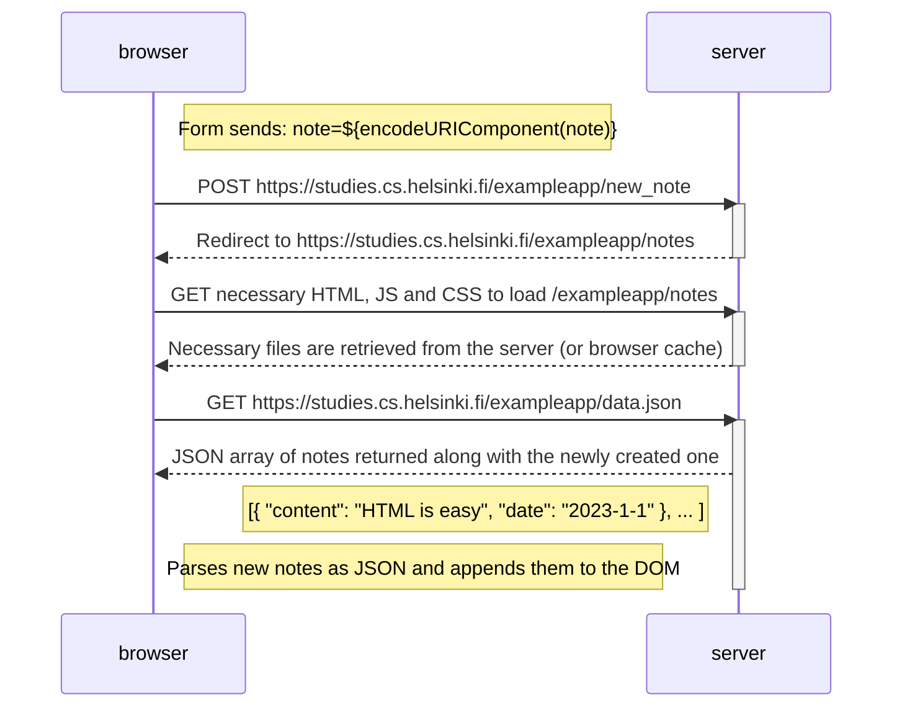

# New note diagram

```mermaid
sequenceDiagram
    participant browser
    participant server

    Note right of browser: Form sends: note=${encodeURIComponent(note)}
    browser->>server: POST https://studies.cs.helsinki.fi/exampleapp/new_note
    activate server
    server-->>browser: Redirect to https://studies.cs.helsinki.fi/exampleapp/notes
    deactivate server

    browser->>server: GET necessary HTML, JS and CSS to load /exampleapp/notes
    activate server
    server-->>browser: Necessary files are retrieved from the server (or browser cache)
    deactivate server

    browser->>server: GET https://studies.cs.helsinki.fi/exampleapp/data.json
    activate server
    server-->>browser: JSON array of notes returned along with the newly created one
    Note left of server: [{ "content": "HTML is easy", "date": "2023-1-1" }, ... ]
    Note right of browser: Parses new notes as JSON and appends them to the DOM
    deactivate server
```
