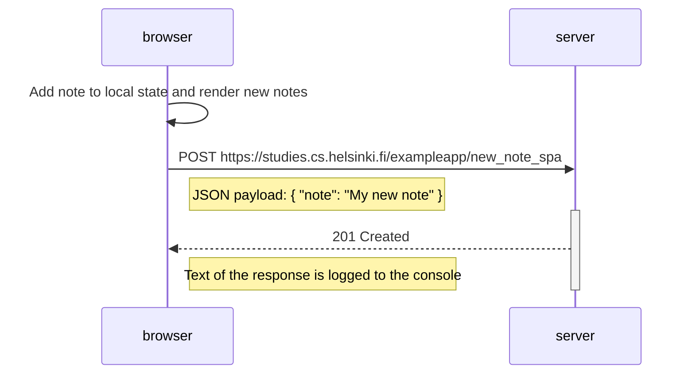

# New note SPA diagram

```mermaid
sequenceDiagram
    participant browser
    participant server

    browser->>browser: Add note to local state and render new notes
    browser->>server: POST https://studies.cs.helsinki.fi/exampleapp/new_note_spa
    Note right of browser: JSON payload: { "note": "My new note" }
    activate server
    server-->>browser: 201 Created
    Note right of browser: Text of the response is logged to the console
    deactivate server
```
